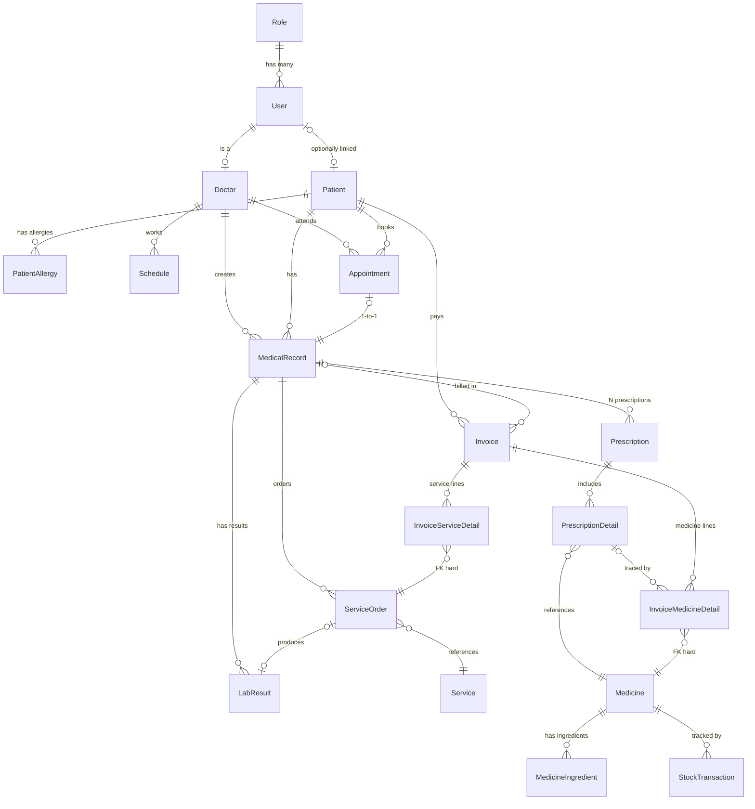
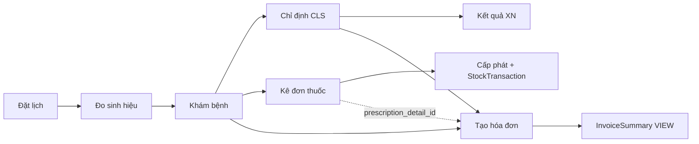

# ERD — Hệ thống Quản lý Phòng mạch tư (v4.0 — 20 bảng + 1 VIEW)

## Sơ đồ tổng quan



## Luồng nghiệp vụ



## Cảnh báo dị ứng khi kê đơn

```sql
-- Query: kiểm tra BN có dị ứng với thuốc sắp kê không
SELECT pa.allergen_name, pa.severity, pa.reaction
FROM PatientAllergy pa
JOIN MedicineIngredient mi ON LOWER(pa.allergen_name) = LOWER(mi.ingredient_name)
WHERE pa.patient_id = :patient_id AND mi.medicine_id = :medicine_id;
```

## Báo cáo doanh thu (dùng InvoiceSummary VIEW)

```sql
SELECT MONTH(invoice_date) AS thang,
       SUM(service_total)  AS doanh_thu_dv,
       SUM(medicine_total) AS doanh_thu_thuoc,
       SUM(medicine_profit) AS loi_nhuan_thuoc,
       SUM(total_amount)   AS tong_doanh_thu
FROM InvoiceSummary
WHERE status = 'PAID'
GROUP BY MONTH(invoice_date);
```
